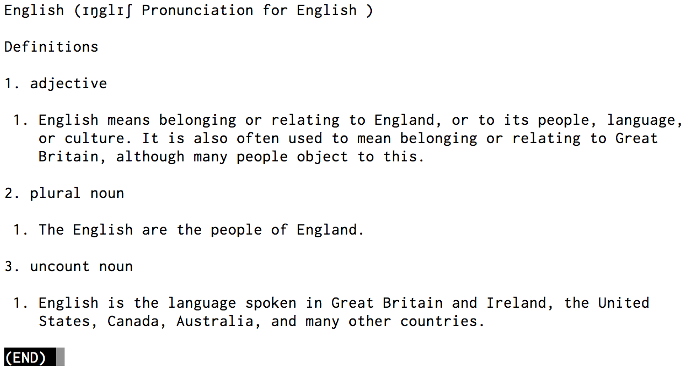

# コマンドライン英英辞書(cob)

コマンドラインからオンラインのコウビルド英英(English for Learners)検索結果を見ることができるようにするスクリプトです．**MacOSX**でなるべくインストールするコマンドが無いようにしました．必要なのは**w3m**だけだと思います．

* コウビルド英英(English for Learners)
[http://www.collinsdictionary.com/dictionary/english-cobuild-learners/english](http://www.collinsdictionary.com/dictionary/english-cobuild-learners/english)

* こちらがを参考にしました
[http://taka.no32.tk/diary/20050826.html](http://taka.no32.tk/diary/20050826.html)
[http://d.hatena.ne.jp/aki-yam/20080629/](http://d.hatena.ne.jp/aki-yam/20080629/)

# インストール
PATHの通っている場所にcobをコピーします．

# 使用方法
ターミナルでcob englishなどcobのあとに調べたい英単語を入力します

cob english

